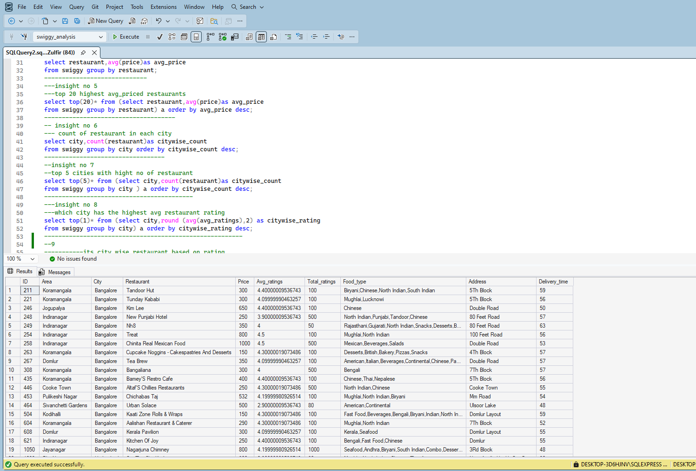

# Swiggy SQL Data Analysis Project

## Project Overview

This project analyzes Swiggy restaurant data using SQL Server.

The aim of this project is to generate business insights related to restaurant performance, pricing, ratings, popularity, and city-wise distribution.

---

## Tools Used

* SQL Server
* SQL
* GitHub

---

## Dataset Information

The dataset contains:

* Restaurant Name
* City
* Area
* Average Rating
* Total Ratings
* Price

---

## SQL Concepts Used

* SELECT
* WHERE
* GROUP BY
* ORDER BY
* Aggregate Functions
* CASE Statements
* Subqueries
* CTE (Common Table Expressions)
* DENSE_RANK()
* NTILE()
* Window Functions

---

## Business Insights Generated

* Cities Served by Swiggy
* Restaurant Count Analysis
* Average Price Analysis
* City-wise Restaurant Distribution
* Top Rated Restaurants
* Most Expensive Restaurants
* Popularity Score Analysis
* Hidden Gem Restaurants
* Price Segment Analysis
* City Contribution Analysis
* Top 20% Popular Restaurants

Total Insights Generated: 22

---

## Project Folder Structure

SQL Queries/
Insights/
Screenshots/

